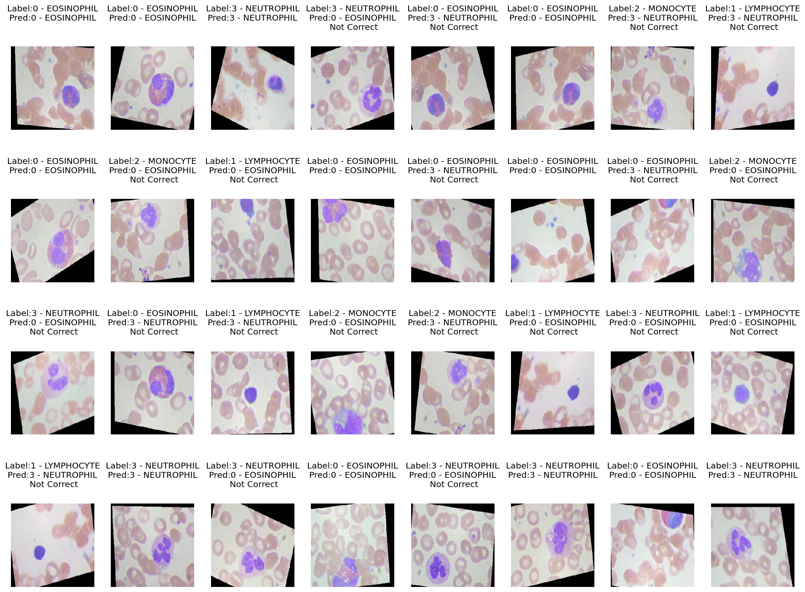

# Проект "Классификация изображений"

## Описание проекта
Данный проект посвящен классификации изображений с использованием нейронных сетей. Он представляет собой интерактивное веб-приложение, разработанное с использованием библиотеки Streamlit.

Приложение состоит из двух основных разделов:
1. **Kлассификация спортивных видов**: Этот раздел предназначен для загрузки изображения, после чего происходит предсказание класса спортивного вида на изображении с использованием предварительно обученной модели.
2. **Классификация клеток крови**: В этом разделе пользователь может загрузить изображение клеток крови, и модель предсказывает тип клетки на изображении (например, эозинофил, лимфоцит и т. д.).

## Структура проекта
Проект состоит из следующих модулей:
- `sportclassifier.py`: Модуль, отвечающий за классификацию спортивных видов.
- `cellclassifier.py`: Модуль, отвечающий за классификацию клеток крови.

## Использованные технологии
Для разработки проекта использовались следующие технологии и библиотеки:
- Python
- PyTorch для обучения моделей классификации
- Streamlit для создания интерактивного веб-приложения
- Библиотеки для обработки изображений: Pillow, torchvision.transforms

## Как использовать
1. Запустите приложение.
2. В разделе "Kлассификация изображений" выберите изображение спортивного вида или изображение клеток крови.
3. Нажмите кнопку "Предсказать".
4. Просмотрите результаты предсказания, который будет отображен на экране.

## О проекте
Этот проект создан в рамках исследовательской работы по классификации изображений. Он может быть использован для обучения моделей машинного обучения и демонстрации их способности классифицировать изображения на практике.

